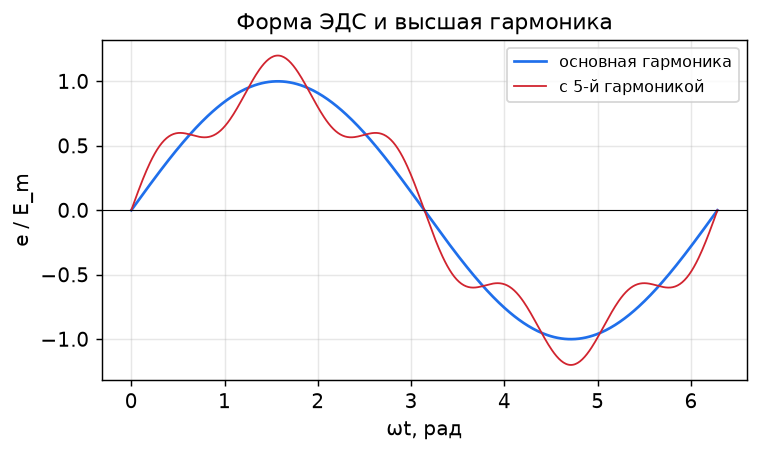

# Лекция 03. Магнитное поле и ЭДС обмотки

**Модуль I. Устройство и физические основы**

---

## 1. Вращающееся магнитное поле

Если по трёхфазной обмотке статора, оси фаз которой сдвинуты в пространстве на 120°, протекают токи, сдвинутые во времени на 120°, то их суммарная МДС образует **вращающееся магнитное поле** постоянной амплитуды.

Амплитуда результирующей МДС равна `3/2` от амплитуды МДС одной фазы, а поле вращается с синхронной частотой:

```
n₁ = 60 f / p
```

Направление вращения определяется порядком чередования фаз; меняя местами две фазы, меняют направление вращения на обратное.

Это поле — основа работы всех машин переменного тока. У синхронной машины с ним синхронно вращается поле ротора.

---

## 2. ЭДС обмотки якоря

Когда поле ротора (поток `Φ`) вращается, оно пересекает проводники обмотки статора и наводит в них ЭДС. Для синусоидального распределения поля действующее значение фазной ЭДС:

```
E = 4.44 · f · w · k_об · Φ
```

где:
- `f` — частота, Гц;
- `w` — число последовательно соединённых витков фазы;
- `k_об` — обмоточный коэффициент;
- `Φ` — амплитуда основного магнитного потока на полюс, Вб.

Коэффициент `4.44 = π·√2 ≈ 4.44` появляется при переходе от амплитудного потокосцепления к действующей ЭДС синусоиды.

---

## 3. Обмоточный коэффициент

Реальная обмотка распределена по пазам и часто выполнена с укороченным шагом. Из-за этого ЭДС отдельных проводников складываются не арифметически, а геометрически — суммарная ЭДС меньше. Это учитывает **обмоточный коэффициент**:

```
k_об = k_р · k_у
```

### 3.1. Коэффициент распределения `k_р`
Обмотка фазы распределена по `q` пазам на полюс и фазу; ЭДС соседних катушек сдвинуты на угол `α`. Тогда:

```
k_р = sin(q·α/2) / (q · sin(α/2))
```

Распределение слегка снижает основную ЭДС, но сильнее ослабляет высшие гармоники — форма ЭДС становится ближе к синусоиде.

### 3.2. Коэффициент укорочения `k_у`
При укорочении шага обмотки до `β = y/τ` (где `y` — шаг, `τ` — полюсное деление):

```
k_у = sin(β · 90°)
```

Укорочение шага специально выбирают так, чтобы подавить определённую гармонику (например, 5-ю или 7-ю).



---

## 4. Высшие гармоники ЭДС

Реальное поле в зазоре не строго синусоидально → ЭДС содержит высшие гармоники (3, 5, 7-ю и т. д.). Они ухудшают форму напряжения и вызывают дополнительные потери.

Способы подавления:
- **Распределение обмотки** (несколько пазов на полюс и фазу) — ослабляет высшие гармоники.
- **Укорочение шага** — целенаправленно «убивает» выбранную гармонику.
- **Скос пазов** — сглаживает зубцовые гармоники.
- В трёхфазной системе с соединением в звезду без нулевого провода **3-я гармоника** (и кратные трём) в линейном напряжении отсутствует.

---

## 5. Численный пример

**Задача.** Турбогенератор: `f = 50 Гц`, `p = 1`, число витков фазы `w = 30`, обмоточный коэффициент `k_об = 0.92`, поток на полюс `Φ = 1.2 Вб`. Найти фазную ЭДС.

**Решение:**
```
E = 4.44 · f · w · k_об · Φ
E = 4.44 · 50 · 30 · 0.92 · 1.2
E ≈ 7351 В ≈ 7.35 кВ
```

**Проверка размерности и смысла:** при увеличении тока возбуждения растёт `Φ`, значит, ЭДС `E` растёт линейно — пока магнитопровод не насыщен (см. ХХХ в Лекции 5).

---

## 6. Поле возбуждения и характеристика холостого хода

Поток `Φ` создаётся током возбуждения `I_в`. Зависимость `E₀(I_в)` при холостом ходе и номинальной скорости — это **характеристика холостого хода (ХХХ)**, по сути магнитная характеристика машины:

- на начальном участке `E₀ ∝ I_в` (магнитопровод не насыщен);
- затем кривая загибается из-за **насыщения** стали.

ХХХ — фундамент для определения параметров машины (Лекция 5 и `Лаб01`).

---

## 7. Выводы

1. Трёхфазная обмотка создаёт вращающееся поле с частотой `n₁ = 60 f / p`.
2. Фазная ЭДС: `E = 4.44 f w k_об Φ`.
3. Обмоточный коэффициент `k_об = k_р · k_у < 1` учитывает распределение и укорочение обмотки.
4. Распределение и укорочение шага улучшают форму ЭДС, подавляя высшие гармоники.
5. ЭДС растёт с потоком (током возбуждения) линейно лишь до насыщения — это отражает ХХХ.

## Вопросы для самоконтроля
1. При каких условиях поле трёхфазной обмотки получается круговым вращающимся?
2. Выведите/поясните формулу `E = 4.44 f w k_об Φ`. Откуда коэффициент 4.44?
3. Зачем применяют укорочение шага обмотки?
4. Почему 3-я гармоника отсутствует в линейном напряжении звезды?

## Связанная лабораторная
`Лаб01` (после Лекции 5): снятие характеристики холостого хода `E₀(I_в)` и КЗ.
