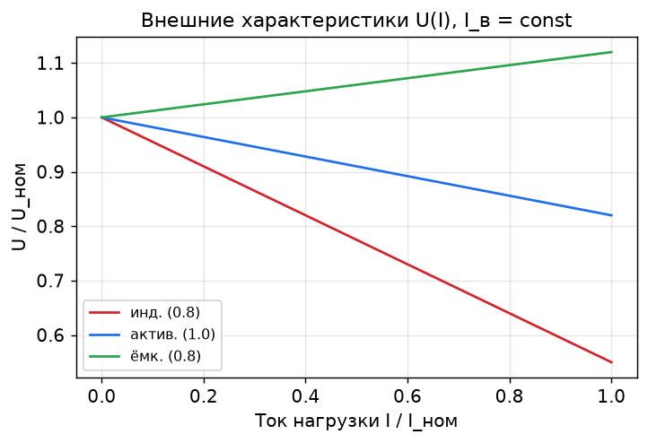

# Лекция 07. Характеристики генератора. Потери и КПД

**Модуль II. Синхронный генератор: установившиеся режимы**

---

## 1. Основные эксплуатационные характеристики

Работу генератора при автономной нагрузке описывают три характеристики (при `n = const`):

- **Внешняя:** `U(I)` при `I_в = const`, `cos φ = const`.
- **Регулировочная:** `I_в(I)` при `U = const`, `cos φ = const`.
- **Нагрузочная:** `U(I_в)` при `I = const`, `cos φ = const`.

Все они — следствие реакции якоря (Лекция 4) и падения на `X_d`.

---

## 2. Внешняя характеристика U(I)

Показывает, как меняется напряжение на зажимах при росте тока нагрузки и **неизменном возбуждении**. Форма зависит от характера нагрузки:

| Нагрузка | Поведение `U(I)` |
|----------|------------------|
| Индуктивная (`cos φ < 1`, отстающий) | `U` сильно **падает** (размагничивающая реакция + падение на `X_d`) |
| Активная (`cos φ = 1`) | `U` падает умеренно |
| Ёмкостная (опережающий) | `U` может **расти** (намагничивающая реакция) |

**Номинальное изменение напряжения** при сбросе нагрузки:
```
ΔU% = (E₀ − U_ном)/U_ном · 100%
```
Для индуктивной нагрузки `ΔU%` велико (десятки процентов) — поэтому генераторы снабжают автоматическими регуляторами возбуждения (АРВ).



---

## 3. Регулировочная характеристика I_в(I)

Показывает, как нужно менять ток возбуждения, чтобы **удержать напряжение постоянным** при изменении нагрузки:

| Нагрузка | Поведение `I_в(I)` |
|----------|--------------------|
| Индуктивная | `I_в` приходится сильно **увеличивать** (компенсировать размагничивание) |
| Активная | `I_в` увеличивать умеренно |
| Ёмкостная | `I_в` можно **уменьшать** |

Это «зеркало» внешней характеристики: где напряжение проседает сильнее, там и подкачка возбуждения нужна больше.

---

## 4. Нагрузочная характеристика

`U(I_в)` при постоянном токе нагрузки. Лежит ниже ХХХ (из-за падения на `X_d` и реакции якоря). Частный случай при `I = I_ном`, `cos φ = 0` — **индукционная нагрузочная характеристика**, по которой строят характеристический треугольник Потье для оценки `X_σ` и реакции якоря.

---

## 5. Потери и КПД

Потери в синхронном генераторе:

1. **Электрические в обмотке якоря:** `P_эл = m·I²·R_a`.
2. **Потери на возбуждение:** `P_в = I_в²·R_в` (+ потери в возбудителе).
3. **Магнитные (в стали):** на гистерезис и вихревые токи в сердечнике статора.
4. **Механические:** трение в подшипниках, вентиляция.
5. **Добавочные:** от высших гармоник и зубчатости.

КПД:
```
η = P₂ / P₁ = P₂ / (P₂ + ΣP)
```
где `P₂` — отдаваемая электрическая мощность, `ΣP` — суммарные потери. У крупных генераторов `η = 96…99%`.

Максимум КПД достигается при нагрузке, где **переменные** потери (`∝ I²`) равны **постоянным** (магнитные + механические).

---

## 6. Численный пример

**Задача.** Генератор отдаёт `P₂ = 1000 кВт`. Потери: якоря `P_эл = 18 кВт`, возбуждения `P_в = 9 кВт`, магнитные `8 кВт`, механические `6 кВт`, добавочные `3 кВт`. Найти КПД.

**Решение:**
```
ΣP = 18 + 9 + 8 + 6 + 3 = 44 кВт
P₁ = P₂ + ΣP = 1000 + 44 = 1044 кВт
η = 1000 / 1044 ≈ 0.958 = 95.8%
```

---

## 7. Выводы

1. Внешняя характеристика `U(I)`: индуктивная нагрузка сильно снижает `U`, ёмкостная может повышать.
2. Регулировочная `I_в(I)` — зеркальна внешней: для удержания `U` при индуктивной нагрузке возбуждение наращивают.
3. Номинальное изменение напряжения велико → нужен автоматический регулятор возбуждения.
4. КПД `η = P₂/(P₂+ΣP)`; максимум при равенстве переменных и постоянных потерь; у крупных машин 96–99%.

## Вопросы для самоконтроля
1. Почему при ёмкостной нагрузке напряжение генератора может расти?
2. Как связаны внешняя и регулировочная характеристики?
3. Перечислите виды потерь и укажите, какие зависят от тока нагрузки.
4. При какой нагрузке КПД максимален и почему?

## Связанная лабораторная
`Лаб02` — снятие внешних и регулировочных характеристик при разных `cos φ`.
