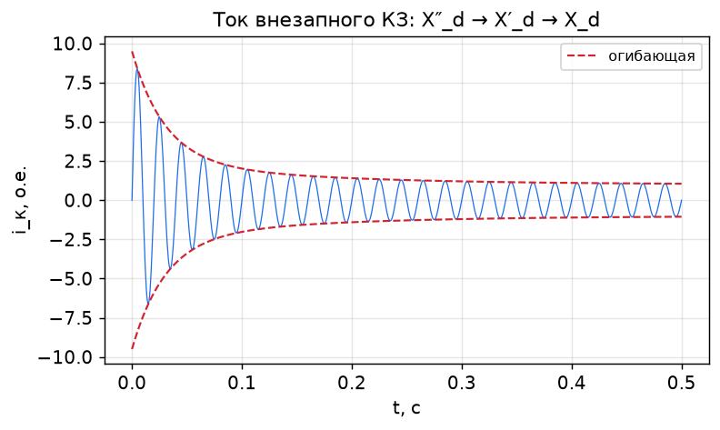

# Лекция 12. Переходные процессы и специальные машины

**Модуль IV. Переходные процессы и специальные машины**

---

## 1. Внезапное короткое замыкание

При внезапном трёхфазном КЗ на зажимах генератора ток якоря резко возрастает. Из-за инерции магнитных потоков (закон постоянства потокосцепления) в первый момент машина ведёт себя иначе, чем в установившемся КЗ:

- **первый момент:** ток ограничен только малой **сверхпереходной** реактивностью → ток максимален (ударный);
- затем апериодическая и периодическая составляющие **затухают**, ток снижается до установившегося значения, определяемого `X_d`.

Качественно ток КЗ = установившаяся периодическая составляющая + затухающая периодическая (сверхпереходная и переходная) + затухающая апериодическая составляющая.

Ударный ток может в 10–15 раз превышать номинальный — на это рассчитывают электродинамическую стойкость аппаратов и защиту.



---

## 2. Переходные и сверхпереходные реактивности

Магнитная инерция контуров ротора (обмотки возбуждения и демпферной) приводит к тому, что в разные моменты времени машина характеризуется разными реактивностями:

| Реактивность | Когда «работает» | Соотношение |
|--------------|------------------|-------------|
| **Сверхпереходная** `X″_d` | первые периоды (действуют демпферная обмотка и обмотка возбуждения) | наименьшая |
| **Переходная** `X′_d` | после затухания токов в демпферной обмотке | средняя |
| **Синхронная** `X_d` | установившийся режим | наибольшая |

Соотношение: `X″_d < X′_d < X_d`.

Затухание описывается **постоянными времени** `T″_d`, `T′_d` (сверхпереходная и переходная) — они определяют, как быстро ток спадает от ударного к установившемуся.

Эти параметры критичны для расчёта токов КЗ, выбора аппаратуры и настройки релейной защиты.

---

## 3. Краткое представление об уравнениях Парка (dq0)

Для анализа переходных процессов трёхфазные величины (`a, b, c`) преобразуют в систему координат `d–q–0`, вращающуюся вместе с ротором (**преобразование Парка**). При этом синусоидальные величины в установившемся режиме становятся постоянными, а индуктивности — не зависящими от угла поворота. Это резко упрощает анализ переходных процессов и синтез систем управления приводом.

В осях `d–q` машина описывается уравнениями потокосцеплений и напряжений по каждой оси с параметрами `X_d`, `X_q`, `X′_d`, `X″_d` и постоянными времени. Подробный вывод выходит за рамки курса, но идея — основа векторного управления (FOC) синхронным приводом.

---

## 4. Специальные синхронные машины

### 4.1. Синхронные машины с постоянными магнитами (PMSM, СДПМ)
Поле возбуждения создают **постоянные магниты** на роторе. Нет обмотки возбуждения, колец и потерь на возбуждение → высокий КПД и удельная мощность. ЭДС синусоидальна. Применяются в сервоприводах, электромобилях, станках. Недостаток — нельзя регулировать поток магнитов (только реакцией якоря).

### 4.2. Вентильный двигатель BLDC
Конструктивно близок к PMSM, но ЭДС **трапецеидальная**, управляется блоками по 120° (по датчикам положения). Прост в управлении, дёшев; применяется в вентиляторах, бытовой технике, дронах.

### 4.3. Реактивный и синхронно-реактивный двигатель (SynRM)
Работает только за счёт **реактивного момента** (`X_d ≠ X_q`), без магнитов и возбуждения. Дешёвый и надёжный ротор; в паре с современным управлением конкурирует с асинхронным приводом по КПД.

### 4.4. Шаговый двигатель
Дискретное вращение по шагам; разновидность синхронной машины для точного позиционирования без обратной связи.

---

## 5. Современные тренды

- **Высококоэрцитивные магниты** (NdFeB) → компактные мощные PMSM.
- **Прямой привод (direct drive)** без редуктора, в т. ч. тихоходные генераторы для **ветроэнергетики**.
- **Векторное управление (FOC)** на базе dq-модели → высокое качество регулирования момента и скорости.
- **Безредукторные тяговые приводы** электромобилей и транспорта на PMSM/SynRM.

---

## 6. Численный пример (оценка ударного тока)

**Задача.** Генератор: `E₀ = 1.0` о.е., `X″_d = 0.12` о.е. Оценить начальный сверхпереходный ток КЗ (без учёта апериодики) и сравнить с установившимся при `X_d = 1.0` о.е.

**Решение:**
```
I″ = E₀ / X″_d = 1.0 / 0.12 ≈ 8.3 о.е.
I_уст = E₀ / X_d = 1.0 / 1.0 = 1.0 о.е.
```
Сверхпереходный ток в ≈ 8 раз больше установившегося — отсюда требования к стойкости аппаратов.

---

## 7. Выводы

1. При внезапном КЗ ток ограничен сначала `X″_d`, затем `X′_d`, в установившемся режиме — `X_d` (`X″_d < X′_d < X_d`).
2. Затухание описывается постоянными времени `T″_d`, `T′_d`; ударный ток — основа выбора аппаратуры.
3. Преобразование Парка (`d–q–0`) упрощает анализ переходных процессов и лежит в основе FOC.
4. Специальные машины: PMSM, BLDC, SynRM, шаговые — каждая со своей нишей.
5. Тренды: магниты NdFeB, прямой привод, векторное управление, генераторы для ВИЭ.

## Вопросы для самоконтроля
1. Почему ток внезапного КЗ сначала больше, а затем спадает?
2. Чем отличаются `X″_d`, `X′_d` и `X_d` и когда «работает» каждая?
3. Зачем нужно преобразование Парка?
4. Чем PMSM отличается от BLDC и от SynRM?

## Связанная лабораторная
Материал обобщается; практический акцент — в `Лаб04` (двигательный режим).
